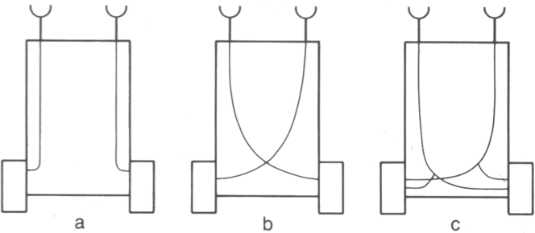

# Mobile Robots - Homework assignment

## Braitenberg Vehicle

The behavior you are asked to implement is a purely reactive controller called “Braitenberg vehicle”,
proposed by Valentino Braitenberg in his book [“Vehicles: Experiments in Synthetic Psychology”](http://books.google.de/books/about/Vehicles.html?id=7KkUAT_q_sQC)
(MIT Press 1984). The behaviour of these vehicles is based on the principle of a direct mapping
between sensors and motors, as explained and illustrated on the lab class slides.

As you have already learned, our target robotic platform is omni-directional
and is controlled by sending *geometry_msgs/Twist* messages to the
**cmd_vel** topic. These messages comprise both linear and angular
components of the desired robot's velocity. In the Braitenberg vehicles,
however, *differential-drive* control is assumed. Therefore your first
task is to implement the **_differential_drive_emulator_** node. It will
listen to the **cmd_vel_diff** topic, where messages of the type
*amr_msgs/WheelSpeeds* will be published. These messages convey the
speeds of two wheels. Upon reception of such a message the node should calculate
and publish a velocity command that will make the robot move as a differential-
drive platform would have moved if its wheels were spinning with the given
speeds.

The second main task is to implement  the **_braitenberg_vehicle_** node,
which should listen to the **sonar_braitenberg** topic, and "respond"
to each sonar reading by a message with two wheel speeds. It should be possible
to change the type ("A", "B", or "C"), and the connection factors of the
vehicle.

The final task is to test-run at least one setting for each vehicle type, and
**briefly describe** (in free form) the behavior of the robot and the differences
in the behavior between the different types. The amount of inhibition and/or
excitation is up to you - however, your robot should show a significantly
different behaviour for each vehicle type.

## Remarks

You are supposed to implement the required functionality within the
"**amr_braitenberg**" package. As this is your first ROS application, some
scaffold code for the required nodes is provided in the corresponding files
("**nodes/differential_drive_emulator.py**", "**nodes/braitenberg_vehicle.py**" and
"**src/amr_braitenberg/braitenberg\_vehicle.py**"). You will need to complete the marked
sections in these files.

You may use "**braitenberg.launch**" launch script to start the simulation and
the two nodes. It will also open the dynamic reconfiguration GUI.

The description of behaviors should be put in a file called
"**amr_braitenberg/BEHAVIORS.md**". If you wonder what the "**.md**"
extension means, have a look at [this web page](https://github.com/adam-p/markdown-here/wiki/Markdown-Cheatsheet).

## Grading

The following aspects will be considered while grading your homework:

* Source code runs without crashes
* Proper implementation of the **_differential_drive_emulator_** node
* Proper implementation of the braitenberg vehicles
* Dynamic vehicle reconfiguration
* Description of behaviors
* Reasonable distribution of code changes over multiple commits

As mentioned in class, we expect everyone to submit his/her own,
individual solution.  No group work
is allowed.

## Presentation

Please look into the following aspects and explain them during the lab class presentation:

- Which ROS tools do you know for debugging a distributed system of several running nodes? Use one of the tools to demonstrate the nodes running in the Braitenberg vehicle assignment. Which nodes are there, which topics do they publish to? Use a tool to output one of the Braitenberg vehicle topics.

- The Braitenberg vehicle in this task uses sonars. Plot schematically the output of a Braitenberg vehicle sonar as value measured (y-axis) against distance of the sonar to an obstacle (x-axis). What if instead of the sonars, the robot had photosensitive cells outputting the signal proportional to the light intensity registered by them. Plot schematically what would be the output of such a light sensor (y-axis) against the distance to a light source (x-axis). Would the vehicle behave differently with this sensor response function and what that difference would be as opposed to using sonars?

**Please report the time spent to solve this assignment.**

**Good luck!**
