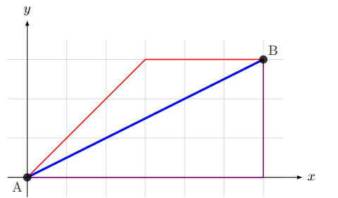
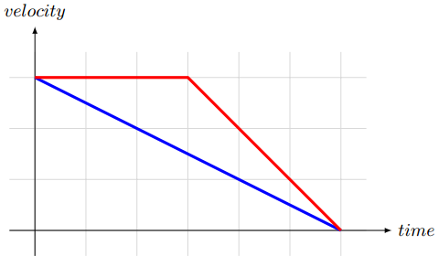

# Mobile Robots - Homework assignment

## Motion Controller

This week you will implement a functional component that is needed in virtually every mobile robot. 
This component is responsible for driving the robot to a specified position in 2D space. 
It is not supposed to do any obstacle avoidance or planning, but rather drive the robot straight to the target pose no matter what.

As discussed in the lab class, the **_motion_controller_** node will conform 
to the [Action API](http://www.ros.org/wiki/actionlib), i.e. allow external 
programs to request a motion to some position and get notified once it was accomplished,
cancelled, or preempted. Luckily, you are not required to write any infrastructure code 
that is needed to make this possible, as it is already implemented and provided to you.

You will concentrate on implementing what we refer to as a "Velocity Controller". 
This entity holds the logic needed to compute the velocity that the robot 
has to have at a given moment in time in order to drive to some target pose from some current pose.

## Task

The task is to implement an "advanced" version of velocity controller that exploits the fact that the robot
base is omni-directional. That means that velocities along both x-axis and y-axis, and around z-axis could be controlled.
The requirements are as follows:

* The robot should move strictly along the straight line that connects the
        source and the target poses.
* The robot should combine linear and angular motions.
* The robot should move at the maximum allowed velocity until it gets
        close to the target. Then it should slow down with some fixed
        acceleration until it eventually stops at the target position.
* The linear and angular motions should end simultaneously as the robot arrives to the end destination.

||
|:--:|
|Fig.1 - Example of the several possible paths that connect points A and B. The OmniVelocityController has to move the robot along the blue path. The violet path demonstrates how the robot moves if it does not combine the velocities along x-axis and y-axis. The red path demonstrates how the robot moves if the care is not taken to ensure that both motions along x and y directions start and stop at the same time. In this example the distance that the robot had to cover along the y direction is less, and therefore the robot is done with this motion earlier|

The first requirement implies that the robot has to combine the motions along
x-axis and y-axis. Moreover, the velocities in *x* and *y*
directions should be selected so that both motions start and end at the same
time. Refer to the figure above, which shows several possible
paths that connect points **A** and **B**. The one plotted in blue is the desired
path.

The second requirement implies that the velocity profile of the robot has a
shape of the half-trapezoid (see figure 2). Note that the
point when the robot starts to slow down depends on the maximum allowed
velocity () and acceleration (). Clearly, the minimum time
needed to slow down and stop is equal to .

||
|:--:|
|Fig.2 - Example plot of the *linear* (red) and *angular* (blue) velocities. In this example the rotation needed to be performed was taking less time than the linear motion, therefore the ramp is adjusted so that the robot starts to slow down the *rotation* right from the beginning.

## Remarks

The target pose is assumed to be reached when the linear and angular distances
to it are both less than some tolerance values (which are controlled though the
parameters of the _**motion_controller**_ node).

The simple version of velocity controller has already been implemented in the file
"**src/amr_navigation/diff_velocity_controller.py**".

The "advanced" version of velocity controller has to be implemented in the
file "**src/amr_navigation/omni_velocity_controller.py**".

The _**motion_controller**_ node has several parameters that influence its behavior (see the
**README.md** file in the root of **amr_navigation** package). In
particular, it is possible to select which velocity controller it uses.
Although the node code is provided, you will have to edit
**amr_navigation/nodes/motion_controller.py** to properly instantiate
the *OmniVelocityController* (because it will depend on how you will
implement it).

This is an individual assignment, no group work allowed.

## Hints

You may use *RViz* to send commands to the _**motion_controller**_. In order to do so you
have to click "*2D Nav Goal*" button in the top panel and then define the
desired target pose by clicking and dragging on the map. We provided you with a configuration file for *RViz* that can be loaded using 
```
roslaunch amr_ui rviz.launch config:=motion-controller
```
or by starting 
```
rosrun rviz rviz
```
and opening the configuration file using the gui menu.

Alternatively, you may use _**move_to_client_gui.py**_ from the
"**amr_ui**" package to send commands by specifying exact coordinates of the
target pose.

## Grading

The following aspects will be considered while grading your submission:

* Does the _**motion_controller**_ work as defined by the requirements with the controller set to "omni"? (6 points)

Do not forget to uphold the proposed workflow.
